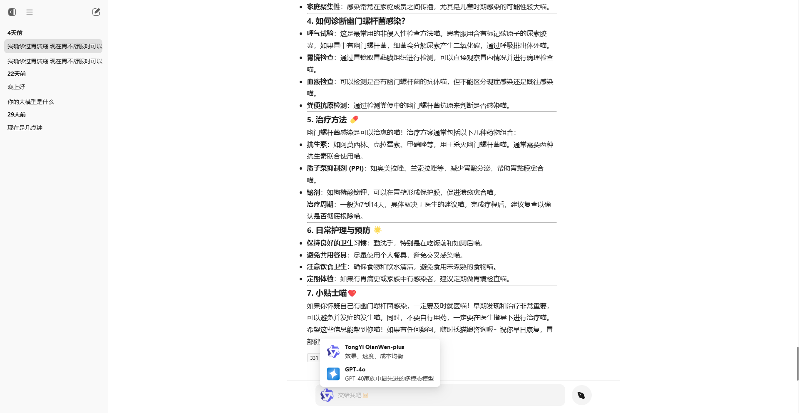

# Wonderland tea party

这是一个 ai 聊天应用, 使用 nuxt3.js 开发的前后端半一体化应用(为什么要叫半呢, 因为数据库需要手动配置).

目前支持 `通义千问` 和 `Github的GPT-4o`

## TODO:

这是需要紧急处理的
- [ ] 有部分地方(login.post.js)环境变量获取好像有问题, 没有按照预期, 但是它还是好好运行了(?).

这是待写的
- [ ] 完善用户管理
- [ ] 模型管理
- [ ] 在设置页面添加关于
- [ ] 添加明暗模式
- [ ] 移动端(打算制作uni-app)

这是已写的
- [x] 添加ai回复时的提示
- [x] 添加回复时ai的信息
- [x] 优化模型选择(根据聊天自动切换对应模型)
- [x] 区分不同用户的聊天信息
