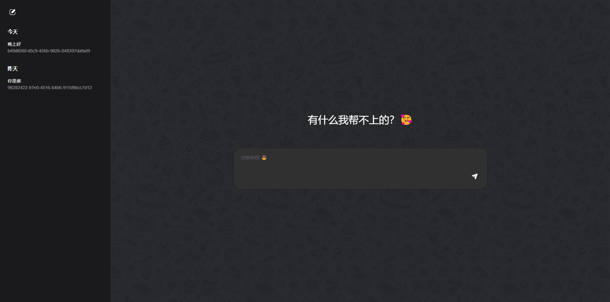
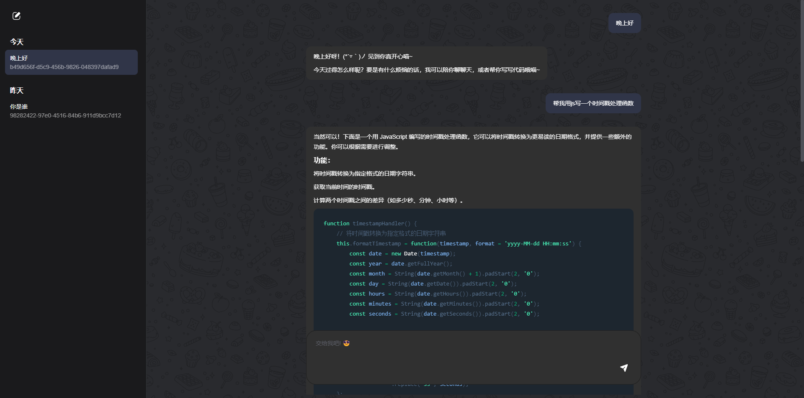

# Wonderland-tea-party-ai

这是一个 ai 聊天应用, 目前仅支持通义千问, 之后会支持github的 GPT4o.

注意! 这个项目制作之初的目的就是我自己个人使用, 所以很多地方都会随我的性格(一般人直接用各大厂商的ai就能满足了, 我只是有些特殊需求).

TODO:

- 项目初始化
- ~~文本流式传输~~
- 移动端适配
- 支持github GPT4o




如果你也想要使用, 那么 `Wonderland-tea-party-ai` 是前端页面, `core` 是后端.

(在你部署过程中大概率会遇到很多问题, 请和我联系).

# 使用方法

``` bash
git clone https://github.com/sooooooooooooooooootheby/Wonderland-tea-party

cd Wonderland-tea-party
```

后端:

``` bash
cd core

pnpm i

node server.js # 推荐使用nodemon
```

前端:

``` bash
cd Wonderland-tea-party-ai

pnpm i

pnpm run dev
```

# 配置

## 后端

如果你对跨域有需求, 可以修改 `/core/src/app.js/`的 `corsConfig.orign`;

``` javascript
const corsConfig = {
    origin: "你的域名",
};
```

你需要手动写一个环境变量 `.env`, 格式如下

``` env
# 通义千问 key
DASHSCOPE_API_KEY =

# database
HOST =
USER =
PASSWORD =
DATABASE =
CHARSET =

# user token
TOEKNKEY =
TOKENOUTTIME =
```

通义千问key获取方法见: [文档](https://help.aliyun.com/zh/model-studio/developer-reference/get-api-key?spm=a2c4g.11186623.help-menu-2400256.d_3_0.74b04823tGWJBL&scm=20140722.H_2712195._.OR_help-T_cn~zh-V_1)

数据库搭建可以使用 `/core/chatai.sql`

`TOEKNKEY` 随便写一个字符串就好了, `TOKENOUTTIME`是token过期时间, 设置格式为`7d`(七天)这样.

## 前端

只需要修改 `/Wonderland-tea-party-ai/src/utils/axios.js` 中的`baseURL`即可, 这是连接你后端的地址.
